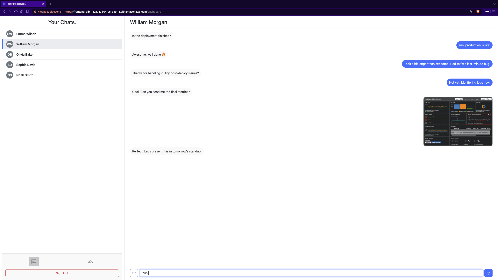

# Messenger App

-009688)

## Table of Contents
- [About the Project](#about-the-project)
- [Features & Microservice Architecture](#features--microservice-architecture)
- [Technologies](#technologies)
- [AWS Infrastructure Overview](#aws-infrastructure-overview)
- [Deployment with Terraform](#deployment-with-terraform)
- [License](#license)

## About the Project
Messenger App is a web-based chat application allowing users to exchange text messages and media files. This version of the project has been re-architected into a **microservices-based system**, with each service independently deployable and scalable.
The entire application is hosted on **AWS using ECS Fargate**, managed by **Terraform**, focusing on a cloud-native, resilient, and modern chat experience.

## Features & Microservice Architecture

Messenger App is a cloud-native application built with a microservice architecture to deliver a scalable and resilient chat experience. Key features are supported by dedicated, independently deployable services:

*   📨 **Real-time Messaging & Chat Management:**
    *   Users can exchange text messages within conversations.
    *   Handled by the **Chat Service** using AWS RDS PostgreSQL for data storage.
*   📁 **Media File Handling:**
    *   Support for sending, receiving, and storing media files.
    *   Managed by the **Media Service**, utilizing AWS S3 for file storage and DynamoDB for metadata.
*   🔐 **User Authentication & Authorization:**
    *   Secure user registration, login, and session management powered by **AWS Cognito**.
    *   Validated by the **API Gateway Service**.
*   🔔 **User Notifications:**
    *   Real-time or asynchronous notifications for events like new messages.
    *   Powered by the **Notification Service**) using AWS SNS and DynamoDB for history.
*   ⚙️ **API Orchestration & Frontend Delivery:**
    *   **API Gateway Service** acts as the central entry point, routing client requests to backend services and handling authentication.
    *   **Frontend Service** provides the responsive user interface (SPA), managing client-side interactions and the OIDC flow.
*   ☁️ **Cloud-Native Foundation:**
    *   All services are **Dockerized** and deployed on **AWS ECS Fargate** for serverless container orchestration.
    *   Each service benefits from **Application Auto Scaling** and a minimum of two replicas for high availability.
    *   The entire infrastructure is defined and managed using **Terraform (IaC)**.
    *   Logs are centralized in **AWS CloudWatch Logs**.

## Technologies
| Component                | Technologies & AWS Services                         |
|--------------------------|-----------------------------------------------------|
| **Frontend**             | Angular, Bootstrap, Docker                          |
| **API Gateway**          | Python, FastAPI, Docker                             |
| **Chat Service**         | Python, FastAPI, SQLAlchemy, Docker, AWS RDS        |
| **Media Service**        | Python, FastAPI, Docker, AWS S3, DynamoDB           |
| **Notification Service** | Python, FastAPI, Docker, AWS SNS, DynamoDB          |
| **Authentication**       | AWS Cognito (User Pools, App Clients)               |
| **Containerization**     | Docker                                              |
| **Orchestration**        | AWS ECS Fargate, Application Auto Scaling           |
| **Load Balancing**       | AWS Application Load Balancer (ALB)                 |
| **Infrastructure (IaC)** | Terraform                                           |
| **Logging**              | AWS CloudWatch Logs                                 |
| **Networking**           | AWS VPC, Subnets, Security Groups, Internet Gateway |
| **Container Registry**   | AWS ECR (Elastic Container Registry)                |

## AWS Infrastructure Overview
The application's cloud infrastructure, managed by Terraform, leverages the following core AWS services:

-   **Networking (VPC):** A custom Virtual Private Cloud providing network isolation, configured with public subnets.
-   **Load Balancing (ALB):** Application Load Balancers for distributing traffic; public-facing for `frontend` and `api-gateway` (HTTPS), and internal for backend microservices (HTTP).
-   **Container Orchestration (ECS & Fargate):** An ECS Cluster (`messenger-app-cluster`) running all application services as serverless Fargate tasks, with auto-scaling enabled.
-   **Container Registry (ECR):** Dedicated ECR repositories for storing Docker images of each microservice.
-   **Databases:**
    *   **RDS PostgreSQL:** For `chat-service` data.
    *   **DynamoDB:** For `media-service` metadata and `notification-service` history.
-   **Storage (S3):** An S3 bucket for media file storage.
-   **Messaging (SNS):** An SNS topic for user notifications.
-   **Identity (Cognito):** A User Pool and App Client for user authentication and management.
-   **Security & Access (IAM):** Roles and policies, including the ECS Task Execution Role, to manage permissions.

## Deployment with Terraform

The entire cloud infrastructure is provisioned and managed using Terraform. The code is organized into reusable modules (`terraform/modules/`) orchestrated by the root `main.tf`.

1.  **Prerequisites:** Ensure AWS CLI is configured and Terraform is installed.
2.  **Build & Push Docker Images:** Build Docker images for all services (`frontend`, `api-gateway`, `chat-service`, `media-service`, `notification-service`) and push them to their respective ECR repositories. This step is crucial if task definitions will reference new image tags.
3.  **Initialize Terraform:** Navigate to the Terraform root directory (e.g., `terraform/`) and run `terraform init`.
4.  **Plan Changes:** Execute `terraform plan -out=tfplan` to review the planned infrastructure changes.
5.  **Apply Changes:** Run `terraform apply tfplan` to create or update the AWS resources.

## License
This project is licensed under the terms of the MIT License. See the [LICENSE](./LICENSE) file for details.
